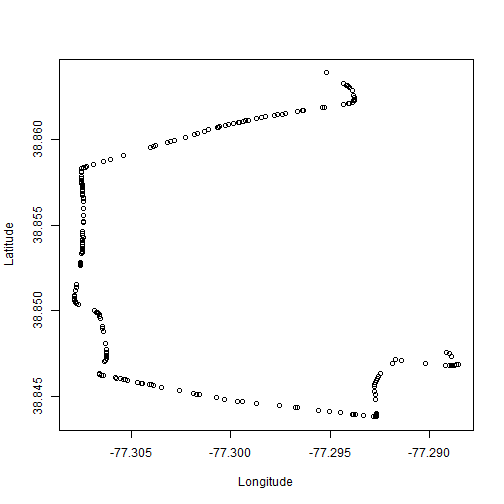

## Why show entire route at once?

Today's route planning software shows an entire route at once. Users have a need to look a small parts of a route to learn details of the route and make decisions about deviating from the computer generated route by taking considerations into account the route planning software did not.  

---

## Open Source Routing Machine (OSRM)

To develop an an app that shows only a percentage of a route we used the Open Source Routing Machine (OSRM http://project-osrm.org/) to generate routes for app development. The next slide shows a typical OSRM route between two points in Fairfax, Virginia.  


---


```r
fn = '0aa1c9fb-2222-4fd9-b9f0-abe528b48ba0.csv'
route_df <- read.csv(fn)
plot(route_df$Longitude, route_df$Latitude, xlab='Longitude', ylab='Latitude')
```




---

##  The app that shows percentage of route

This link will take you to the web app that shows the desired percentage of the same route in the previous slide. Use the slider to extend the route. 

https://lburgwar.shinyapps.io/dynamicfairfaxroute/


